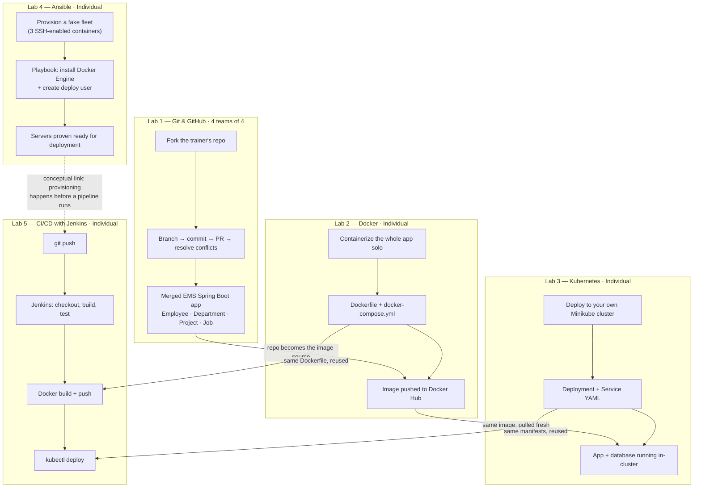

# The EMS DevOps Series — Big Picture

Five half-day labs, one project, each one handing a real artifact to the
next. This page is the one-glance map — link it from your course README
so trainees can see where they are in the journey at any point.

> Renders natively on GitHub (Mermaid support built in) — no extra setup
> needed if this lives in your training repo.

---

## The Journey

---

## Lab-by-Lab Reference

| # | Lab | Model | Duration | Core new skill | Hands forward |
|---|-----|-------|----------|------------------|-----------------|
| 1 | Git & GitHub | 4 teams of 4 | ~3.5 hrs | Fork, branch, PR, merge conflicts | The merged EMS app itself (all 4 entities) |
| 2 | Docker | Individual | ~3.5 hrs | Images, multi-stage Dockerfile, Compose, registry | Dockerfile + a public image on Docker Hub |
| 3 | Kubernetes | Individual | ~3.5 hrs | Pods, Deployments, Services, PVCs, DNS | Deployment/Service YAML manifests |
| 4 | Ansible | Individual | ~3.5 hrs | Playbooks, idempotency, roles, facts | Provisioning pattern (conceptual handoff) |
| 5 | CI/CD (Jenkins) | Individual | ~3.5 hrs | Pipeline as code, automated rollout | The full loop, closed |

**Total: ~17.5 hours across 5 sessions** to go from an empty repo to a
self-updating, automatically-deployed application.

---

## Why Team vs. Individual — the recurring design question

This came up before building every lab after the first one, and the
answer was never automatic — worth keeping as a reference for scoping
future labs the same way.

| Lab | Team or individual? | Why |
|-----|----------------------|-----|
| Git & GitHub | **Team** | Merge, conflict, PR, and review only exist because multiple independent histories are converging — this is collaboration tooling by design. |
| Docker | **Individual** | Build → run → inspect → tag → push is a complete loop for one person on one machine. Splitting it across a team would mean fewer reps per person, not more collaboration value. |
| Kubernetes | **Individual** | The "multiple" in Kubernetes is pods and nodes, not people — one operator can fully exercise every core concept solo. |
| Ansible | **Individual** | Same shape as Kubernetes: one control node, many managed targets. The targets don't need to be other humans' machines. |
| CI/CD | **Individual** *(originally planned as hybrid)* | Was meant to be one shared Jenkins instance, but since nothing in this training setup is on a shared network, it collapsed to the same individual/local pattern as the rest — Jenkins itself just runs natively instead of in Docker to avoid cross-platform config headaches. |

**The general test:** does the *concept itself* require multiple
independent people, or does it just involve managing multiple things
(pods, nodes, servers, containers)? Only the first case genuinely needs
a team.

---

## Design choices worth remembering if you extend this series

- **Every lab reuses a real artifact from the one before it** — no lab
  starts from a fresh, disconnected scenario. That continuity is doing
  a lot of the pedagogical work; it's worth preserving in anything
  added later.
- **Complexity that would derail the lesson gets scoped out explicitly,
  not silently avoided** — e.g., the app never actually got rewired to
  real Postgres in the Kubernetes lab, Docker-in-Docker was avoided in
  both the Docker-in-Ansible and Ansible-in-CI/CD directions, and
  Tomcat stayed a stretch goal rather than forcing a WAR repackage.
  Each of those is called out in the relevant guide's "Scope" section
  rather than hidden.
- **Fill-in-the-blank starters (`????` / `TODO (Lab)`) stay consistent
  across all 5 kits** — trainees learn the pattern once in the Docker
  lab and it holds for the rest of the series.

---

Next candidates if you keep extending this series (from your original
topic list): deeper Kubernetes (Ingress, StatefulSets, Helm), Ansible
Vault and dynamic inventories, or a second CI/CD pass that actually
wires in the Tomcat and full Ansible-provisioning stretch goals as core
material instead of optional extras.
